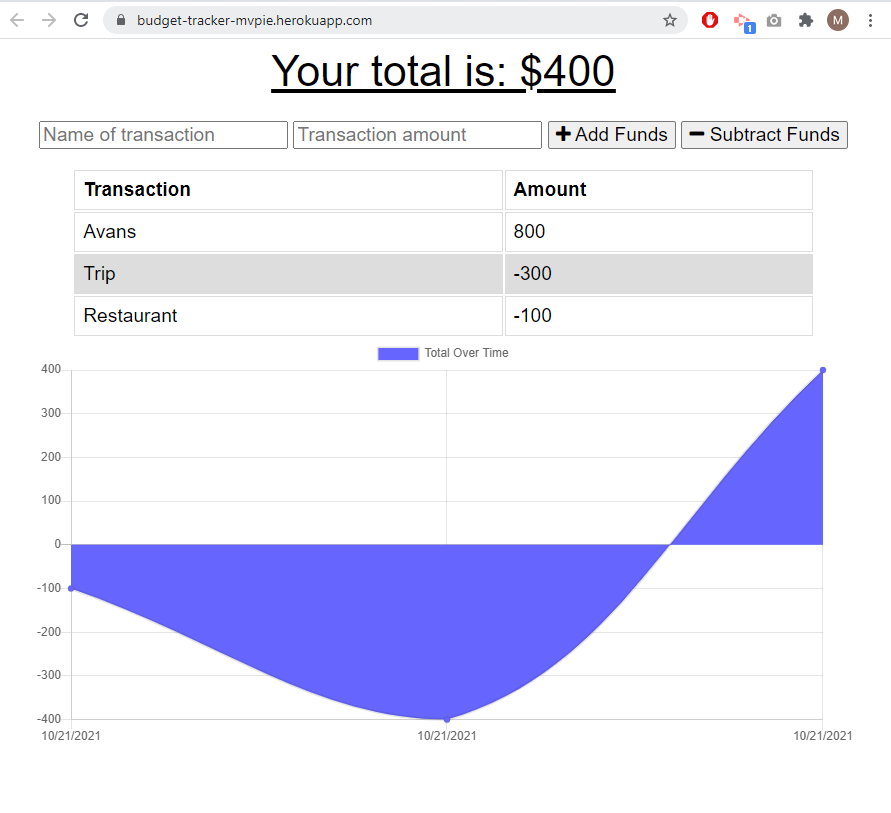

# Online/Offline Budget Trackers

This is Budget Tracker application which allows for offline access and functionality.

The user is able to add expenses and deposits to their budget with or without a connection. When entering transactions offline, it populates the total when brought back online.

Offline Functionality:

  * Enter deposits offline

  * Enter expenses offline

When brought back online:

  * Offline entries should be added to tracker.

## User Story
```
AS AN avid traveller
I WANT to be able to track my withdrawals and deposits with or without a data/internet connection
SO THAT my account balance is accurate when I am traveling
```


## Work Done Screenshot



## What's included
- PWA
- Webmanifest
- Service-worker
- Cache
- IndexedDB
- MongoDB
- Mongoose
- Node.js
- Express.js


## Links to Review

* The URL of the functional, deployed application on Heroku: https://budget-tracker-mvpie.herokuapp.com/

* The URL of the GitHub repository: https://github.com/MaryVPie/budget-tracker

- - -